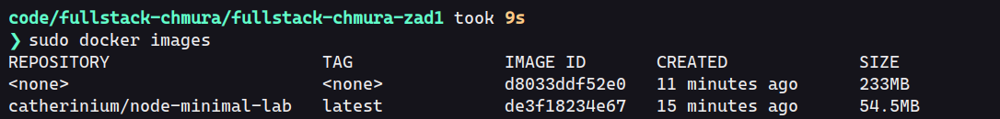
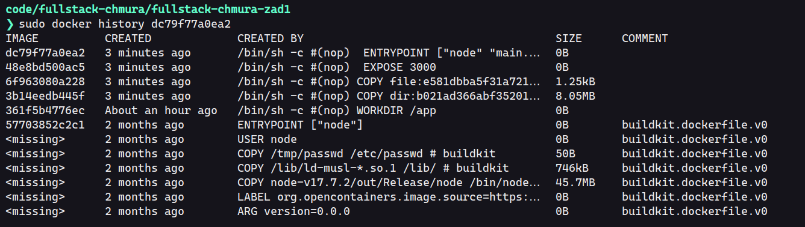
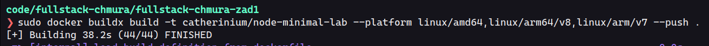
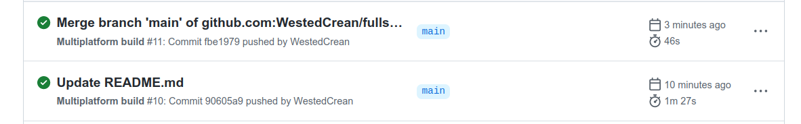
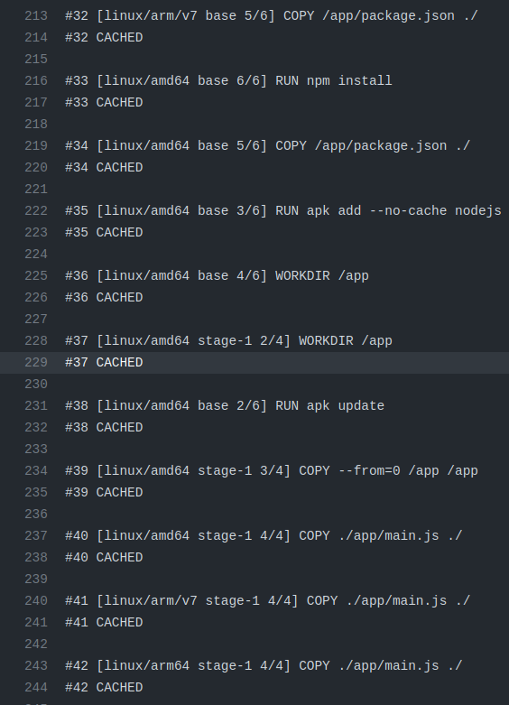

# Programowanie full-stack w chmurach obliczeniowych - Laboratorium 1

Autor: Wiktor Flis <wiktor.flis@pollub.edu.pl>

Napisałem prostą aplikację w Nodejs, której cały kod mieści się w pliku app/main.js

Dockerfile znajduje się w głównym folderze repozytorium znajduje się dockerfile

## Zbudowanie i uruchomienie

Aby zbudować obraz kontenera, uruchamiamy polecenie

`docker build -t node-minimal . `

Aby uruchomić zbudowany kontener oraz przekierować port 3000 kontenera na port 3000 hosta

`docker run -d -p 3000:3000 --name nasz-kontener node-minimal`

## Informacje wyswietlane

Aby sprawdzić informacje ktore wyswietla serwer, uzywamy polecenia

`docker logs nasz-kontener`

## Obraz kontenera

W celu sprawdzenia ile warstw posiada zbudowany obraz, najpierw wykorzystujemy komendę

`docker images`

aby sprawdzić ID naszego obrazu. Mając go, wykorzystujemy komendę 

`docker history <id-obrazu>`

aby zobaczyć kolejne warstwy obrazu w odwrotnej kolejności (czyli zaczynając od najnowszej)

W serwisie dockerhub zamieściłem również wersje obrazów na architektury linux/arm/v7, linux/arm64/v8 oraz linux/amd64

Link do dockerhub: https://hub.docker.com/r/catherinium/node-minimal-lab/tags

## Github Actions

Projekt ma skonfigurowane Github Actions. Pipeline buduje wszystkie architektury jak wyżej oraz publikuje na dockerhub. 

Wykorzystywany jest przy tym cache, dzięki czemu z 1.5 min budowa obrazu jest skracana do 45 sekund:

